자바의 배포버전은 jar

웹의 배포버전은 war


was의 자원을 METO-INF에 놓는다. 


oracle 8 9 10 선택하고 ㄹ리소스에 등록된거 그대로 카피


```xml
<Resource name="jdbc/myoracle" auth="Container"
              type="javax.sql.DataSource" driverClassName="oracle.jdbc.OracleDriver"
              url="jdbc:oracle:thin:@127.0.0.1:1521:mysid"
              username="scott" password="tiger" maxTotal="20" maxIdle="10"
              maxWaitMillis="-1"/>
```


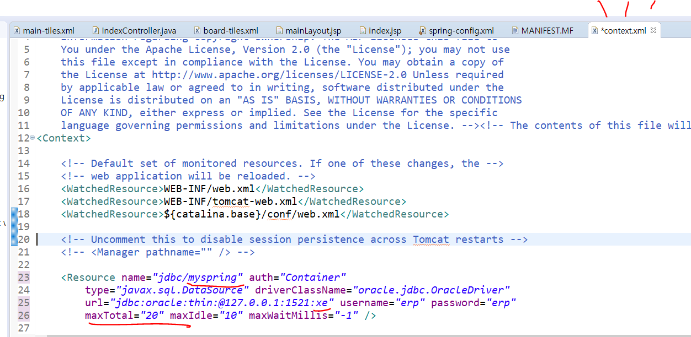

maxtotal : 커넥션 풀 몇개유지할 것인지. 동시에 몇 명 접속할 수 있게 할껀지

커넥션을 사용하고 있어도 minIdle 개 까지 유지하겠다 라는 뜻 


javax.naming > InitialContext 클래스 : 와스에 등록된 자원을 이름을 가지고 찾거나 등록할 때 사용

- lookup사용한다. (이름을 주면, 이름에 해당하는 자원을 찾아온다. )


---

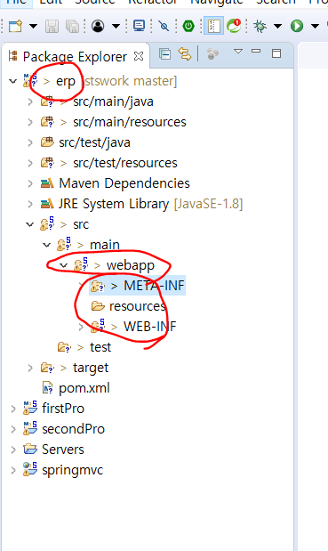

META-INF를 erp의 webapp로 


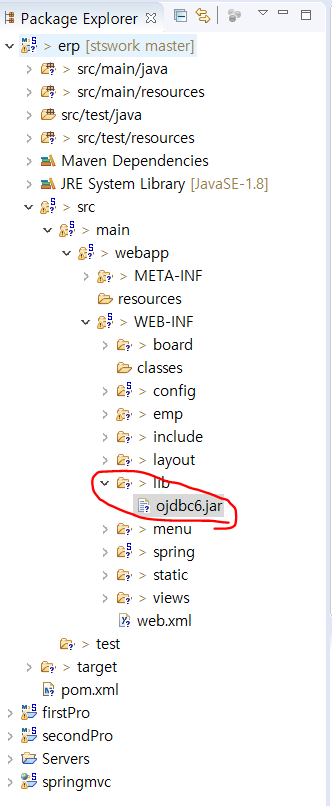


https://mvnrepository.com/artifact/org.springframework/spring-jdbc/4.2.4.RELEASE

에서 

### spring jdbc 라이브러리 추가

```xml
<dependency>
    <groupId>org.springframework</groupId>
    <artifactId>spring-jdbc</artifactId>
    <version>4.2.4.RELEASE</version>
</dependency>
```

현재 쓰는 버전이 4.2.4 이므로 해당 버전 dependency를 찾아 붙여넣어준다. 

그런데 오류가 나서

4.2.4.RELEASE대신 ${org.springframework-version}로 수정한다. 

---

트랜잭션을 위해서, DAO에서 바로 하는게 아니라 단계가 하나 더 있따!

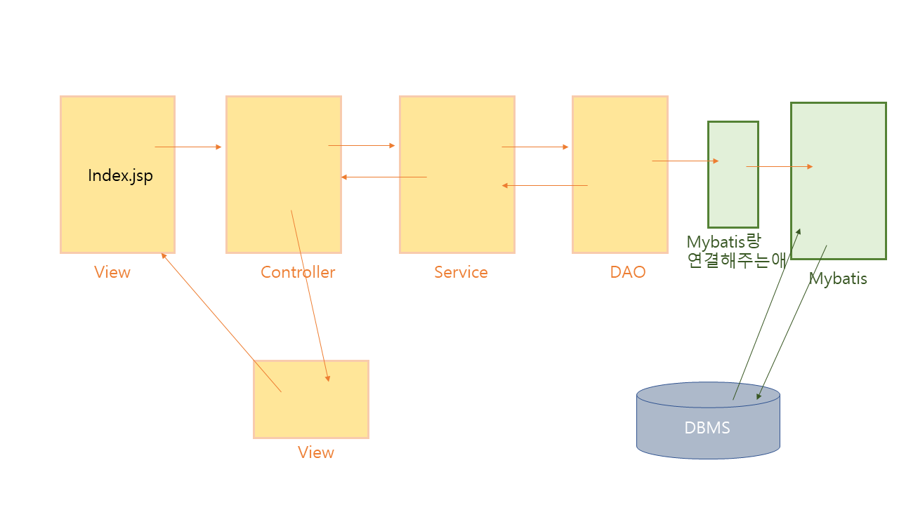

마이바티스가 필요한데, 마이바티스 라이브러리 1개랑, 마이바티스랑 스프링 연결해주는 라이브러리 1개
총 2개를 추가해야한다. 

https://mvnrepository.com/artifact/org.mybatis/mybatis/3.3.0

여기서 mybatis 라이브러리 디펜던시 추가하기.


https://mvnrepository.com/artifact/org.mybatis/mybatis-spring/1.2.3
여기서 mybatis와 spring연동 라이브러리 디펜던시 추가하기

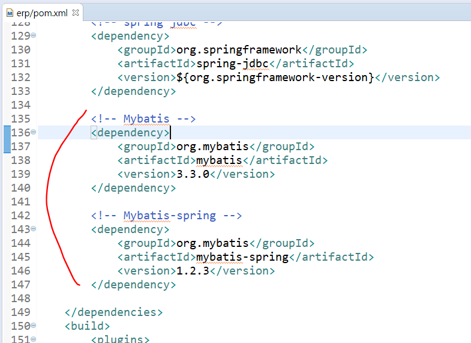


마이바티스 페이지 : https://blog.mybatis.org/ 
마이바티스 튜토리얼, 개발 가이드 : https://mybatis.org/mybatis-3/

---

# Mybatis 작업 : db연동을 위해 사용하는 프레임워크

WAS가 제공하는 connection pool 사용

1. pom.xml에 의존모듈을 추가

   * mybatis
   * mybatis-spring

2. mybatis에서 사용할 설정파일을 작성

   * mybatis메인 설정 파일 : mybatis를 실행할 때 필요한 내용을 정의
     										connection관리를 위해 필요한 내용 (얘는 spring으로 관리하므로 생략)
                                             mapper에 대한 정보
                                             mapper에서 사용할 dto
                                             spring설정파일이 저장되는 위치에 추가
                                             /WEB-INF/config/mybatis-config.xml로 저장

     ​            

   * mapper : sql문을 정의하는 설정 파일
                      테이블 한 개에서 사용하는 sql문을 하나의 mapper파일
                       src폴더에 추가 

3. spring설정 파일(spring-config.xml)에 mybatis를 사용할 수 있도록 등록

   SqlSession객체가  mybatis에서 사용하는 핵심클래스 (spring jdbc의 JdbcTemplate과 동일)

   * connection을 사용(생성)할 수 있도록 등록
   * SqlSession을 사용하려면 factory객체부터 생서해야 하므로 factory객체를 먼저 설정한다.
     (factory객체는 spring에서 mybatis의 핵심클래스를 사용할 수 있게 하기 위한 객체)
     ===> Connection 객체를 사용, mybatis의 메인설정파일을 등록
   * mybatis이 핵심클래스인 SqlSession클래스의 하위클래스를 생성
     `SqlSessionTemplate` : spring-jdbc의 JdbcTemplate과 같은 역할

### [ 기능 추가하기 ]

0. 새로운 테이블로 작업을 한다면, mybatis-config.xml파일에 VO파일과 mapper파일 등록
1. mapper에 sql문 추가
2. DAOImpl클래스에 메소드 정의
   => mybatis의 핵심클래스인 SqlSession클래스를 이용해서 작업
3. ServiceImpl 클래스에서 dao의 메소드 호출할 수 있도록 메소드 정의
4. Controller에서 ServiceImpl의 메소드를 호출해서 작업할 수 있도록 정의
5. Controller에서 response하는 뷰에서 Controller에서 공유해준
    데이터를 꺼내서 출력하기(select작업)
6. Tiles설정 파일에서 뷰 등록 


---

기술 블로그에서 복붙해온다


```xml
<?xml version="1.0" encoding="UTF-8" ?>
<!DOCTYPE configuration
  PUBLIC "-//mybatis.org//DTD Config 3.0//EN"
  "http://mybatis.org/dtd/mybatis-3-config.dtd">
```

config폴더에 mybatis-config.xml 파일을 만들고, 위 소스를 적어준다.

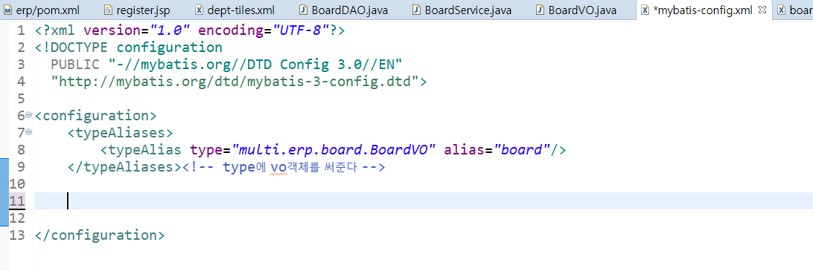

type에 패키지명과 vo객체를 적어준다. 


```xml
<select id="나중에내가식별할이름(고유한값이어야한다.)"></select>
```


멤버변수명은 컬럼값과 똑같아야 한다.

mapper 는 sql문 작성하는것. 마지막에 세미콜론 붙이지 않는다. 


mapper가 많으니까, mybatis-config.xml파일에  `namespace` 값을 준다


alias는 board로 해놨기 때문에 resultType에도 board라고 적어준다.
이 동작은 , mydeptrowmapper 와 같은 동작을 수행한다. 자동으로 맵핑할 수 있게끔 하는 작업

---

spring-config.xml (설정파일)에서 mybatis 빈을 등록해준다.

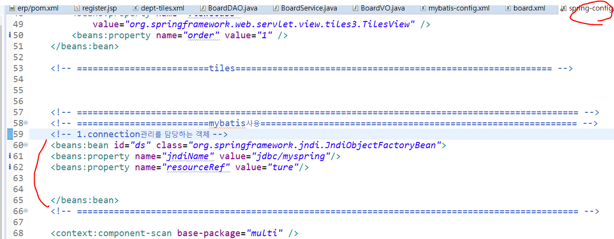

`org.springframework.jndi.JndiObjectFactoryBean`는 스프링의 connection관리를 담당하는객체

---


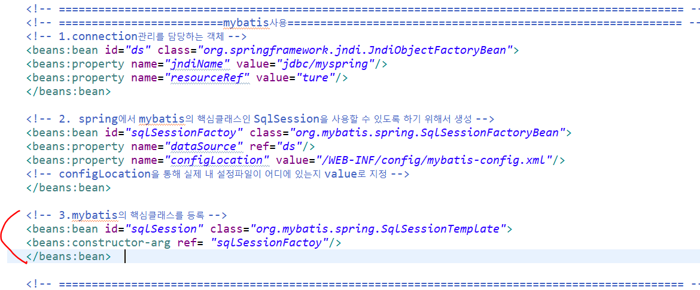


기능이 추가될때마다 board mapper에 계속 추가하면 된다. 

---

Java파일에서, 반드시 상위클래스 만들어줘야 한다. BoardDAO처럼.

BoardDAO인터페이스를 상속하는 BoardDAOImpl 파일 만들어준다.

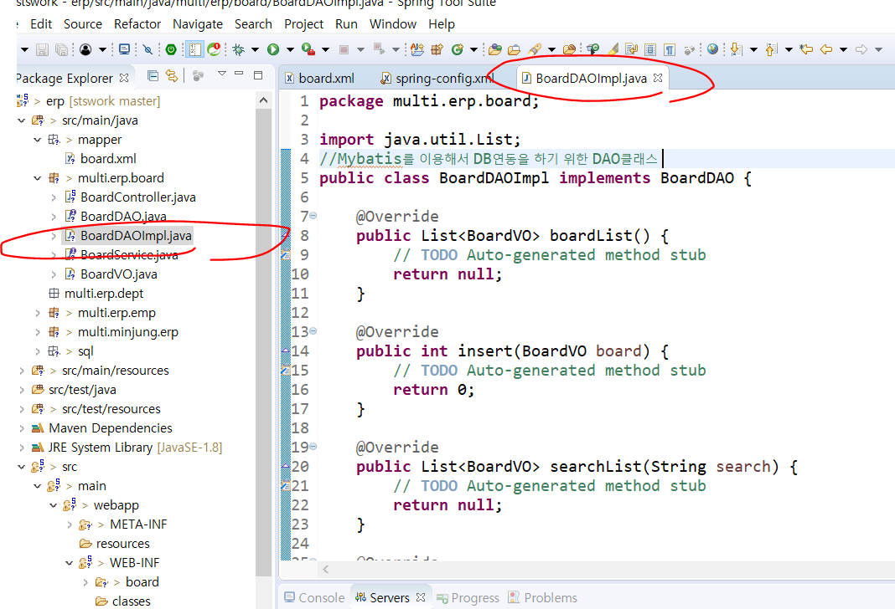

그리고 나서, mybatis의 핵심클래스인 SqlSession을 사용해야 하므로 객체를 만들어준다. 그리고 @Autowired해준다.
sqlSession.한담에 컨트롤 스페이스바 누르면 사용할 수 있는 메소드 쫙 나오는데, 골라서 쓰면 된다.

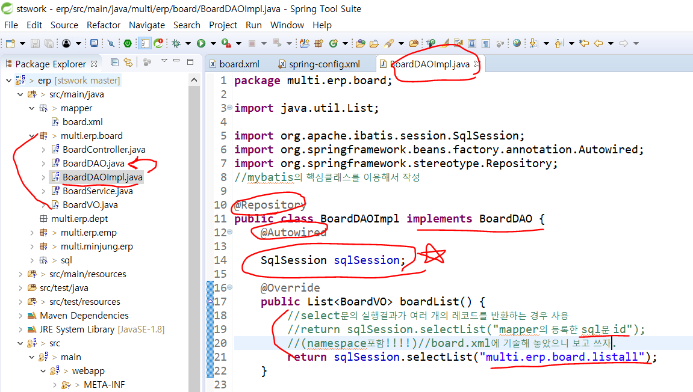

위 내용을 바탕으로 select기능을 하는 contorller를 구현했다.


---

BoardService(인터페이스)를 상속하는 BoardServiceImpl 클래스를 생성한다. 

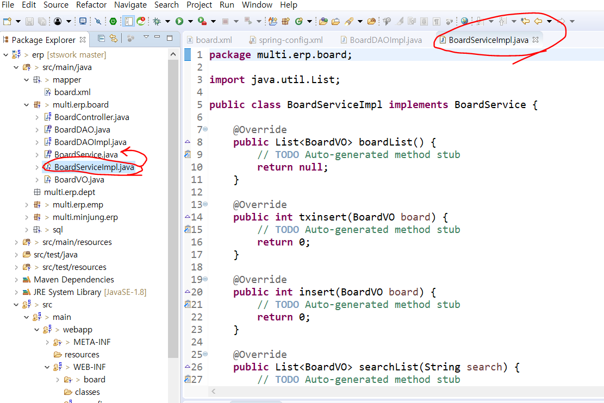

Service 빈 생성해주고, BoardDAO 객체를 만들고 BoardDAOImpl의 boardList()가 실행될 수 있도록 return 값에 적어준다.

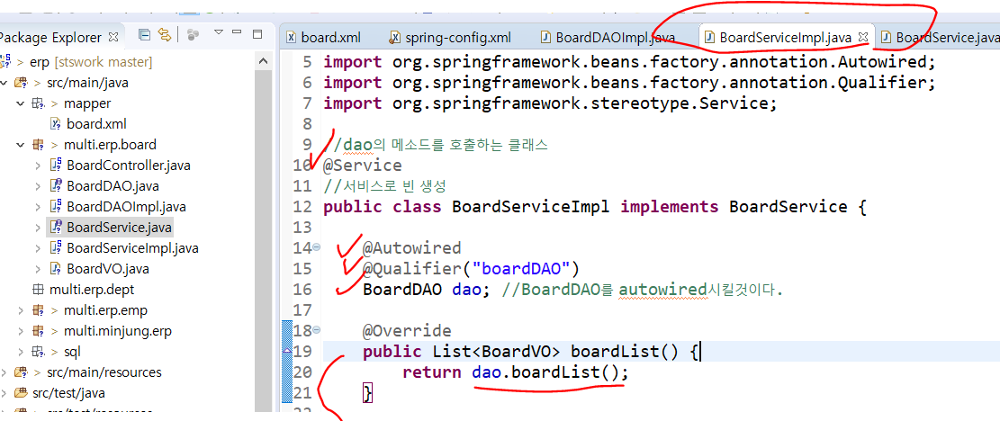

---


이번엔 컨트롤러를 만들어보자. 컨트롤러는 서블릿의 역할을 한다. 전체적인 흐름은 이전에 했던 서블릿과 비슷하다. 

list를 요청할 수 있는 메소드가 있어야 하고, 데이터가 있기 때문에 ModelAndView를 리턴할 것이다. 
컨트롤러에서 요청을 해야 하기 때문에 BoardService 객체를 만들어 준다. 
비지니스 메소드를 호출할 때, service의 boardList()를 호출하는데 그 service의 boardList()는 BoardServiceImpl의 boardList()고, BoardServiceImpl의 boardList()는 dao의boardList()를 리턴하는 형태이다. (연쇄적으로 값을 반환해서 전달해주는 형태다.)


이렇게 작성해 주었다.

---

이번엔 WEB-INF 밑에있는 board폴더에서 작업을 해볼 차례.
board-tiles.xml을 열어 설정을 한다.


---

# 게시글을 작성하는 기능을 추가해본다.


1. tiles.xml파일에 추가한다.
2. 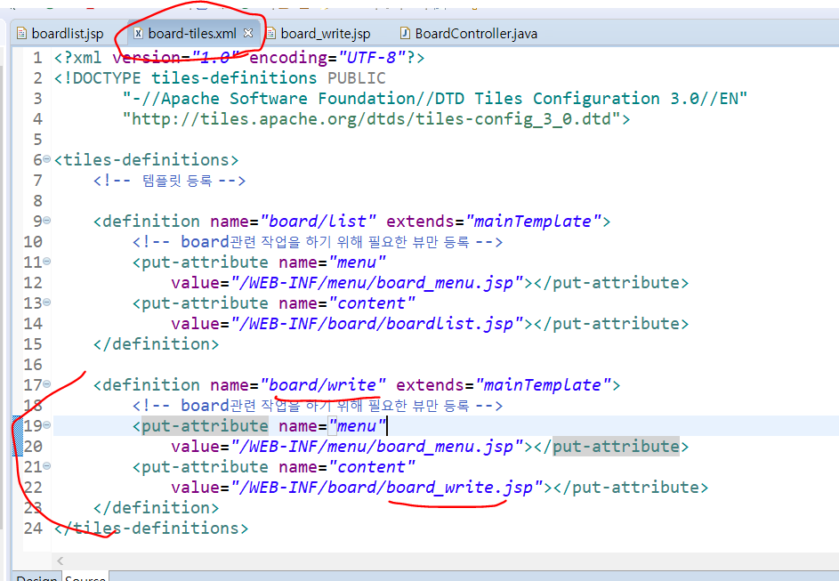


2. Controller.파일에 메소드를 추가한다. 리퀘스트맵핑을 해준다.


3. boardlist.jsp 파일 수정

   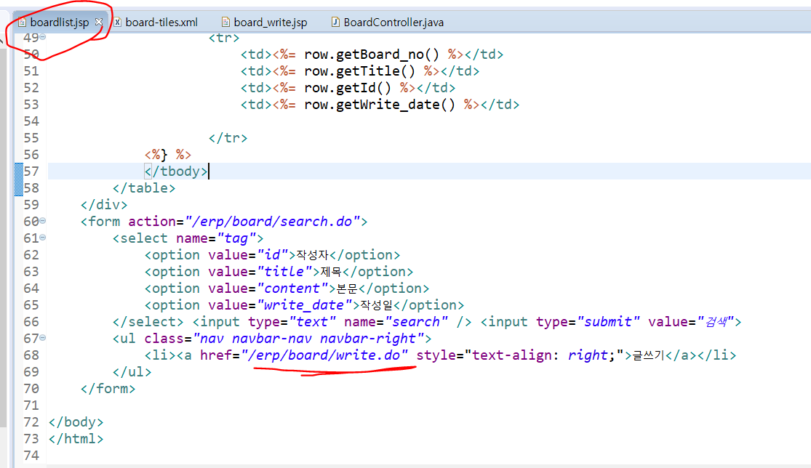

path를 리퀘스트맵핑한 곳에 적어준 것과 동일하게 한다. 

4. BoardController에서 메소드를 작성해준다. GET, POST방식을 나눠서 쓸 수 있다. 


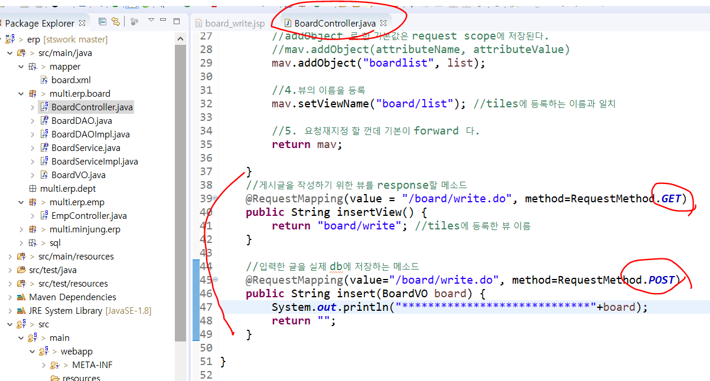

뷰에 name정의한거랑, VO의 name이 똑같아야 한다. 
그러면 자동으로 DTO로 변환해준다. 

5. board.xml 작성

마이바티스에서의 `?` 는 `#{변수명}`  으로 표현한다.

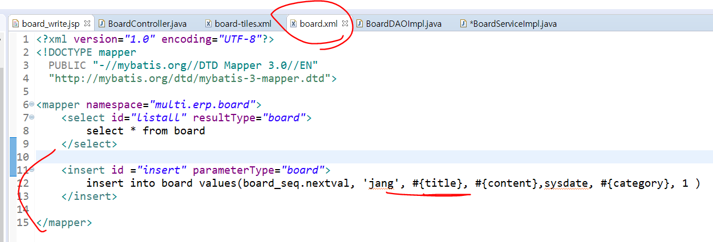


6. BoardDAOImpl.java에서  ㄴ=insert 메소드 사용한다. 


7. BoardServiceImpl.java 에 insert 메소드 수정해준다.

   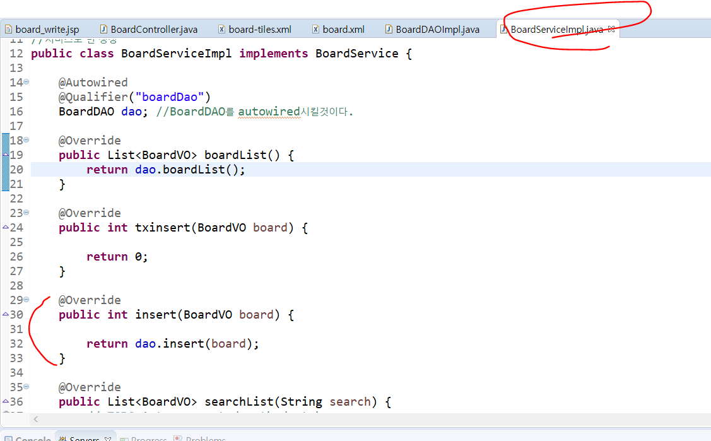

   

8. boardController 수정한다.


