servlet 등록 및 관련은dispatcher

스프링 관련은 스프링설정파일 ex.sprintmvc1.xml


p.325

* HandlerMapping을 따로 등록하지 않으면, 기본으로 설정된 HandlerMapping이 동작하고 기본으로 설정된 HandlerMapping객체는 <bean>의 name속성에서 path와 일치하는 빈을 찾아서 DispatcherServlet으로 리턴한다.


springmvc1에 있던 핸들러맵핑을 springmvc2로 옮기고, springmvc1내용을 수정한다.

```xml
<prop key="키">밸류값</prop>
```


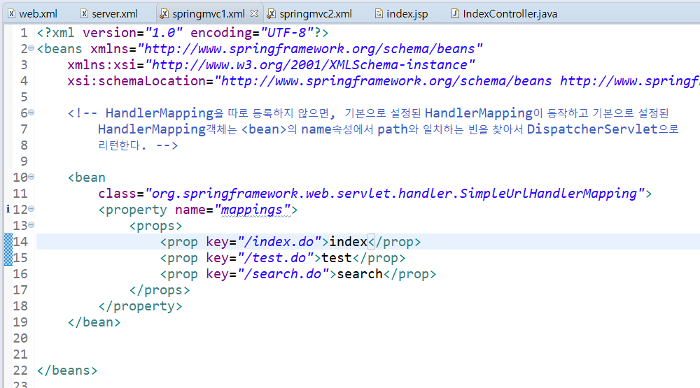

그리고 실행하면 오류난다.


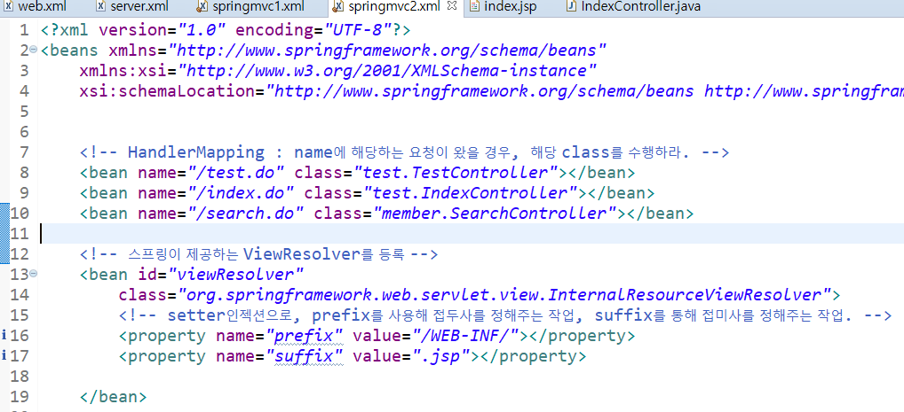

bean의 name을 앞에서 설정한 핸들러맵핑에 맞는 빈 값으로 다음과 같이 수정해준다.

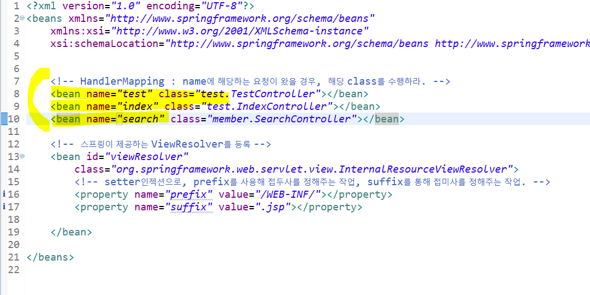

디스패쳐 서블릿이 요청을 받고 핸들러맵핑한테 나 빈좀 찾아줘 하고 의뢰한다. 컨트롤러 찾아달라고.

아무것도 등록 안하면 요청한 패스로 등록된 빈을 찾아서 넘겨주지만, 핸들러맵핑을 등록하면 등록한 방식에 따라 컨트롤러 찾는 방법이 바뀜을 알 수 있다.

핸들러매핑은 컨트롤러를 찾아서 넘겨주는 역할을 한다는 것을 알 수 있다.

---> 하지만 이 방식은 사용하지 않고, 어노테이션을 사용할 예정이다. 

----


## maven을 사용하기 위한 실습 프로젝트 생성하기 p.20

새로운 워크스페이스를 만들고, 기존에 있던 서버를 삭제한다. 

1. 화면 최하단 servers탭에서 delete

2. 패키지 익스플로러에서 Server폴더 통째로 delete, content on disk 까지 체크해서 삭제

3. preference > server> runtime environment에서삭제

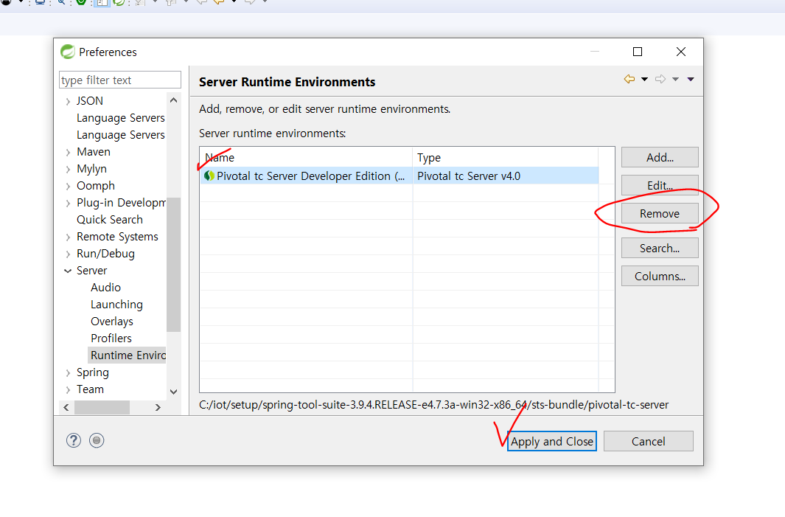

그리고 화면 하단에서 서버 아파치 톰캣 9.0버전으로 만들어 주면 된다. 포트 하나 비어있으니 8005로 추가

### utf-8 로ㅜ설정하기

preference> general >work space >Text file encoding 부분 > Other선택 > UTF-8로 설정

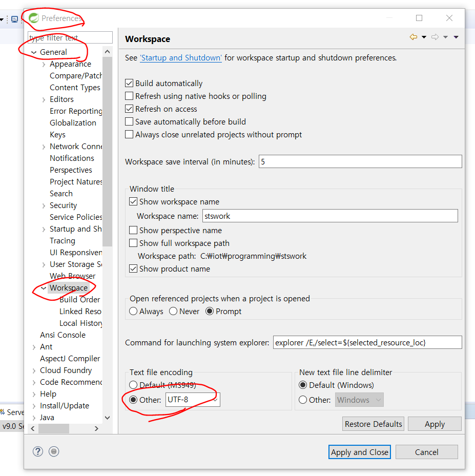


preferences > Web > CSS files, HTML files, JSP files 들어가서  > UTF-8로 변경 

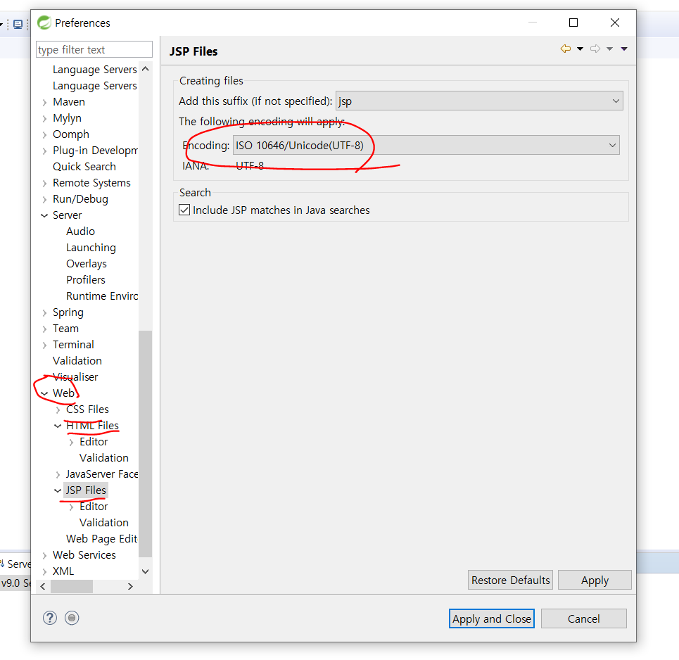


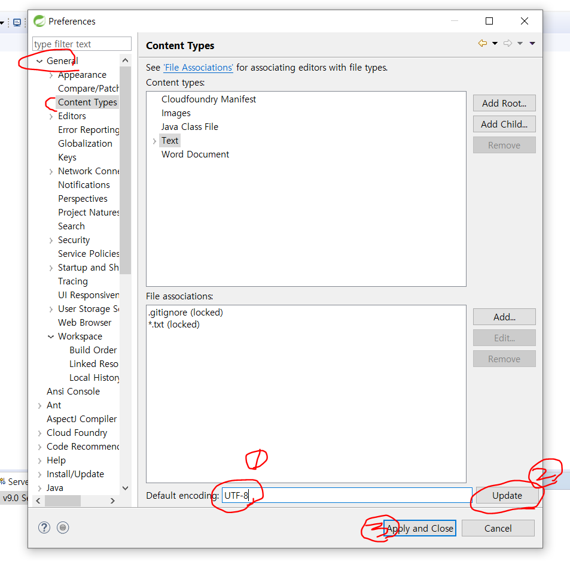


preference > general > content types > UTF-8 기입 후 update > apply and close


* 의존모듈(라이브러리 안에서 사용하고있는 또다른 라이브러리들)

* 메이븐이라는 빌드툴을 사용하면 사이트에 중앙저장소가 있다. 거기에 우리가 사용할 수 있는 라이브러리 등록하거나 저장할 수 있게 되어있고 내 pc로 copy할 수 있다.


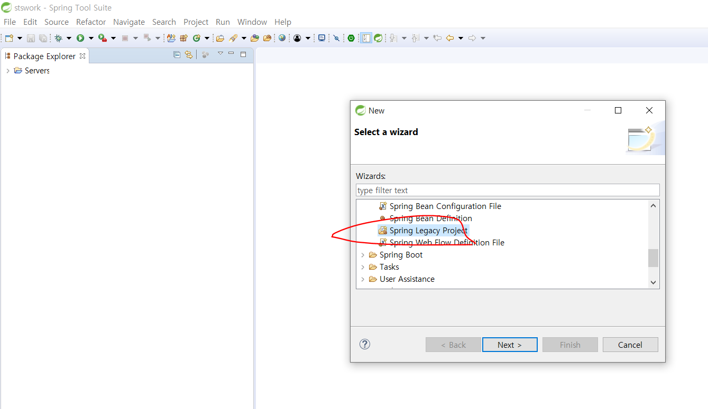


3단계 패키지로 만들 것인데, 마지막 패키지가 context path로 등록이 된다. 
일반적으로contextpath는 프로젝트명과 동일하게 해준다.


메이븐을 사용하면서 다운로드 받은 라이브러리들을 아래 경로에서 확인할 수 있다.


jar파일 7z로 압축 풀어보면 해당 폴더가 나오는데 잘 나오면 정상적으로 다운받아진 것이다. 


스프링에서도 경로 확인할 수 있다.

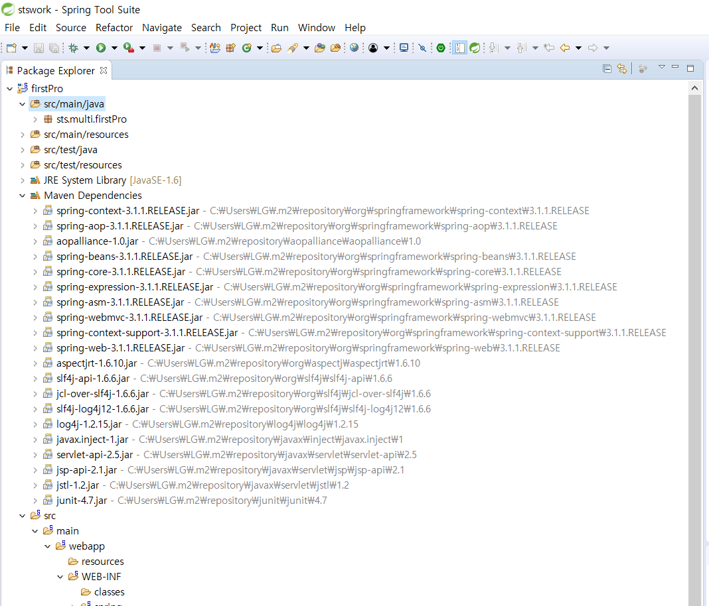


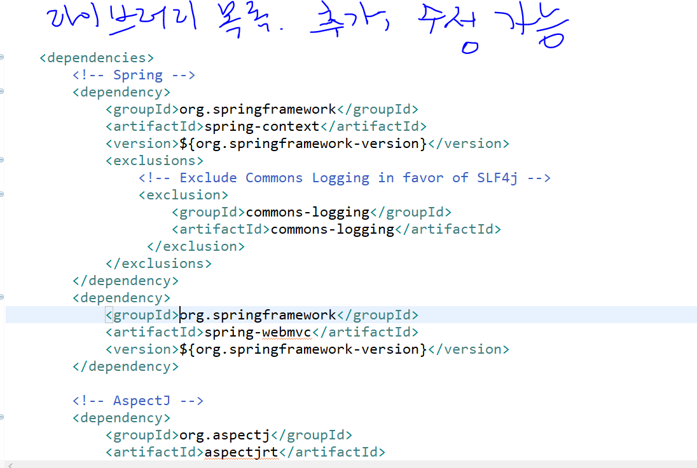

앞으로 이 pom.xml에 라이브러리를 등록하고 사용한다.

https://mvnrepository.com/artifact/org.apache.tiles/tiles-jsp/3.0.8 에서 Maven 코드를 추가할 수 있어서 추가했다. 

mvnrepository.com 에서 검색하여 필요한 소스들 추가하거나 수정할 수 있다.


pom.xml에서 버전을 수정해 준다. 


프로젝트 import 하기 

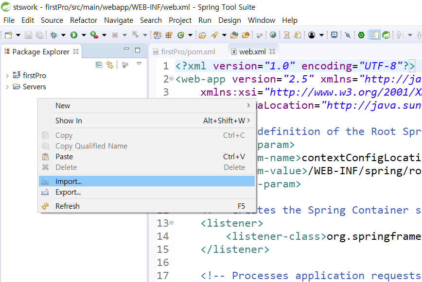

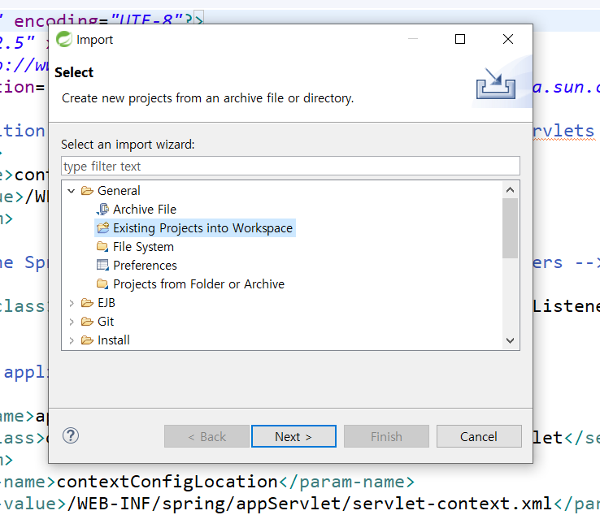

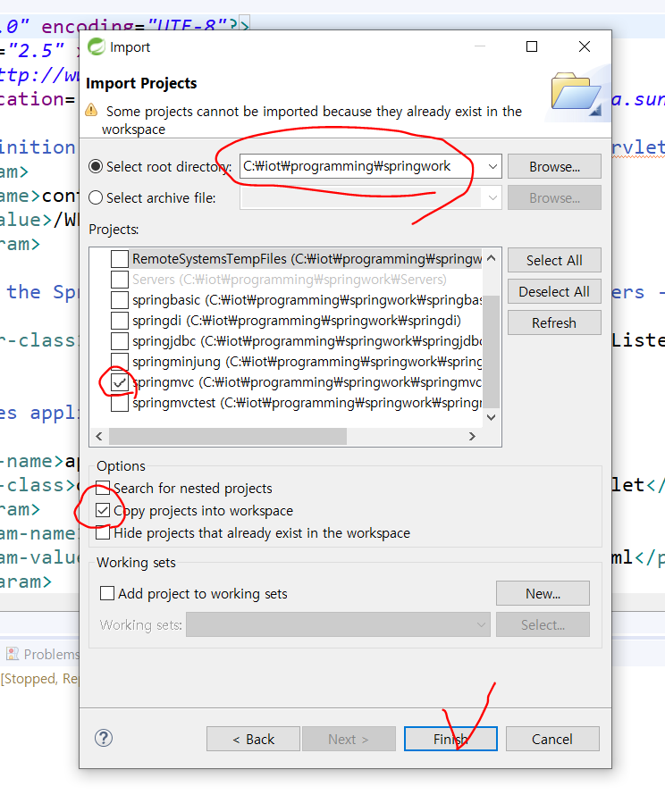

copy projects into workspace 해제하면 아예 원본 경로가 넘어오기 때문에 수정될 위험이 있다.

---


web.xml 수정한다. 

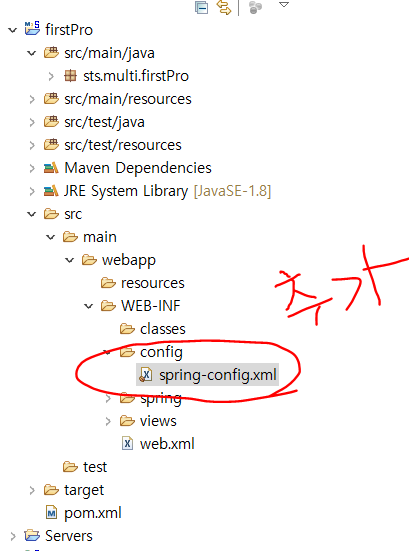


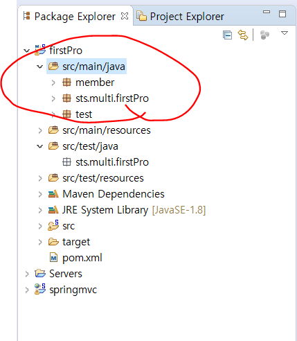

java src패키지 copy해서 넣기 


어노테이션을 하기 위해 빈을 찾을 패키지 등록 (spring-config.xml에 등록)

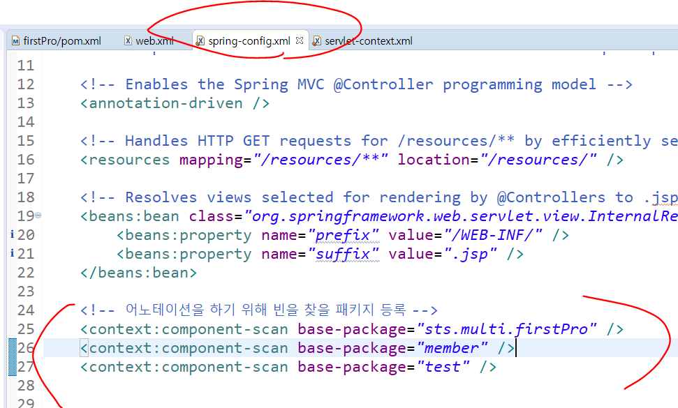


### Controller 클래스 만들기

이전에 controller를 상속했던 것과 다르게, `@Controller` 만 붙여주면 Controller 클래스가 된다. 

상속하고 있는 것이 없기때문에 메소드를 내맘대로 만들 수 있다!

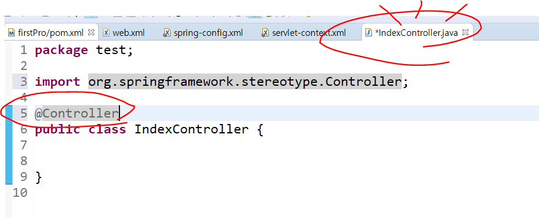

* 어노테이션을 이용해서 컨트롤러를 작성하는 경우, 메소드를 정의할 때 개발자가 원하는 형태로 메소드를 정의할 수 있다.
* 매개변수나 리턴타입으로 올 수 있는 타입들이 정해져 있긴 하지만 그 안에서 원하는 스펙을 다양하게 적용할 수 있다.
* 리턴타입 : String, void, ModelAndView...
  * String : 뷰에 대한 정보만 넘길 때 사용
  * ModelAndView : 공유할 데이터와 뷰에 대한 정보를 함께 리턴
* 매개변수 : String, HttpServletRequest, HttpServletResponse, HttpSession, Model, DTO.....

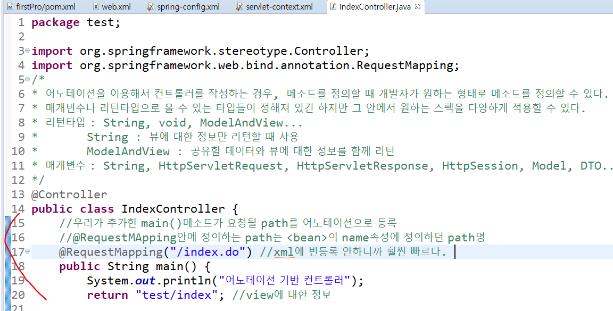


콘솔창에서 맵핑 정보 볼 수 있다.

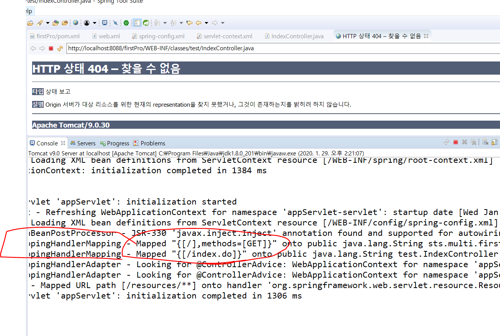

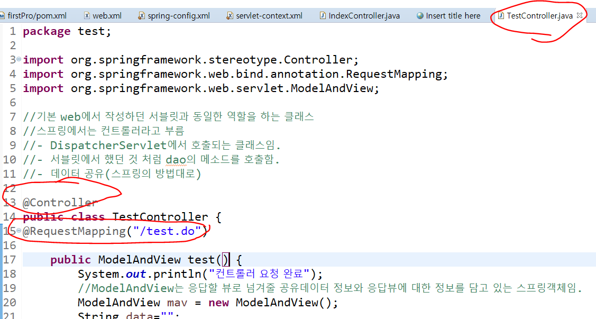

