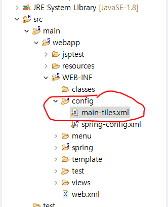
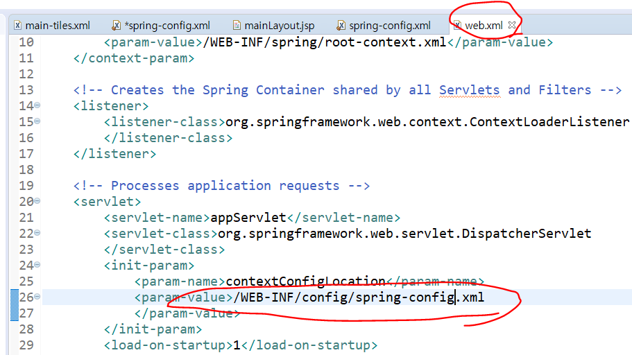
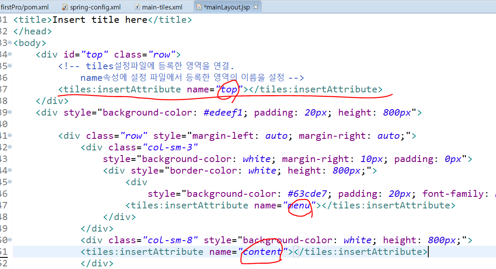
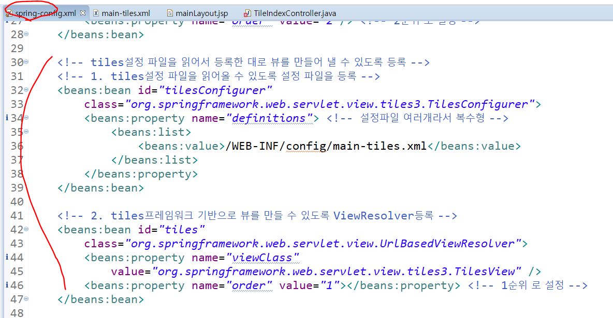
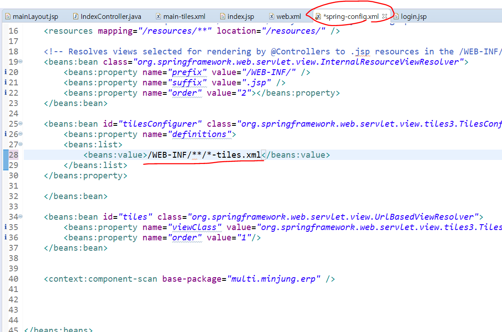
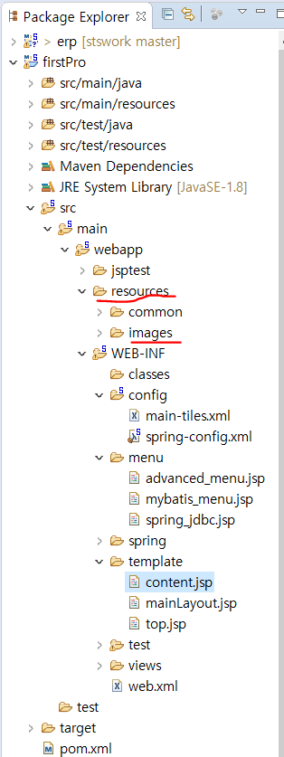
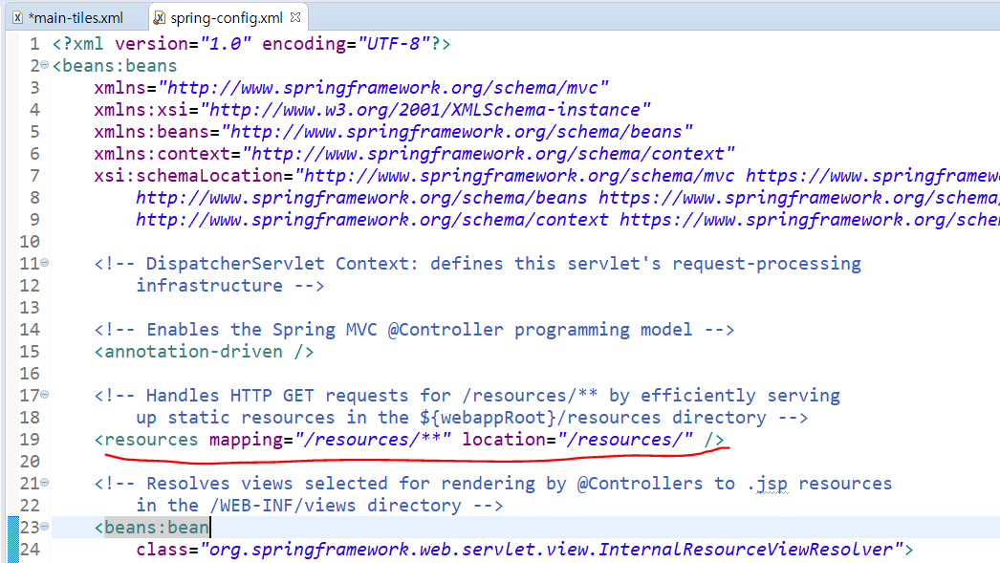
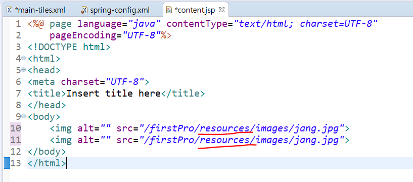
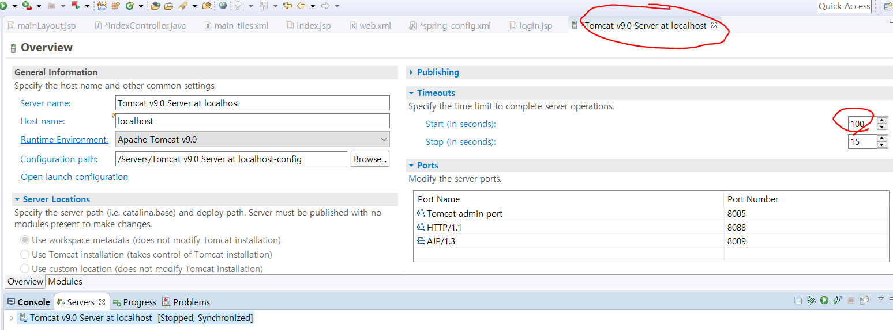

# Tiles를 이용하여 메뉴 고정하기


1. JSP파일 만들 때 세팅해주기 


Tiles프레임워크를 이용해서 화면 구성하기

1. 라이브러리를 pom.xml에 등록

   ```xml
   	<dependency>
   			<groupId>org.apache.tiles</groupId>
   			<artifactId>tiles-jsp</artifactId>
   			<version>3.0.8</version>
   		</dependency>
   ```

   

2. 레이아웃이 적용되어 있는 템플릿파일과 연결할 jsp파일들이 미리 준비되어 있어야 한다.

3. tiles설정파일을 작성(main-tiles.xml)

* 템플릿을 등록

  * 템플릿의 각 영역을 나누고 각 영역에 기본으로 연결할 jsp파일을 설정한다. 

    

  

  

  ```xml
  <?xml version="1.0" encoding="UTF-8"?>
  <!DOCTYPE tiles-definitions PUBLIC
         "-//Apache Software Foundation//DTD Tiles Configuration 3.0//EN"
         "http://tiles.apache.org/dtds/tiles-config_3_0.dtd">
  ```

  를 main-tiles.xml에 복붙하기

  * `<put-attribute>` 속성으로 화면을 나눌 영역을 정해줄 수 있다.

    ```xml
    <tiles-definitions>
    	<!-- 템플릿 등록 -->
    	<definition name="mainTemplate"
    		template="/WEB-INF/template/mainLayout.jsp">
    <!-- 화면 영역 나눔 영역을 나눌 갯수만큼 적어준다. 3개로 나눌꺼니까 3개의 put-attribute적어준다., value에는 실제로 연결할 곳 -->
    		<put-attribute name="top" value="/WEB-INF/template/top.jsp"/>
    		<put-attribute name="menu" value="/WEB-INF/menu/spring_jdbc.jsp"/>
    		<put-attribute name="content" value="/WEB-INF/template/content.jsp"/>
    	</definition>
    
    </tiles-definitions>
    ```

  

  
  web.xml에서 설정파일 기본 인식 위치 수정해준다. 
  
  

4. 템플릿(레이아웃을 미리 설정해 놓은 파일 -  mainLayout.jsp) 으로 만들어 놓은
   jsp파일의 각각 영역이 템플릿에 등록한 영역과 일치하도록 설정 

* tiles에서 제공하는 태그를 사용한다. 
* 내부에서 tiles설정 파일에 등록한 내용과 연결하여 실행하는 작업을 처리하기 위해
  tiles에서 제공하는 태그를 써서 작업해야 한다. 





5. 스프링 내부에서 `DispatcherServlet`이 뷰 정보를 ViewResolver에게 전달하면,
   ViewResolver가 tiles프레임워크를 활용해서 뷰를 만들 수 있도록 spring설정파일에 등록

* tiles설정 파일이 어떤 파일인지 등록

* 만들어야 하는 view가 tiles뷰임을 등록

  

이렇게 * 표시로 설정파일을 다 쓰지 않아도 등록하게 할 수 있다.
폴더의 경우 `**`, 파일명의 경우 `*` 을 사용하면 된다. 



6. 템플릿을 활용해서 만들어질 뷰의 정보를 tiles 설정 파일에 등록

   

---







resources를 기본으로 인식한다는 뜻. /resources/로 요청하면 된다.



---


### 타임아웃 오류 방지하기



start시간을 100이나 150정도로 늘려준다!