# 리눅스 개요

최소 4대의 머신이 필요하기 때문에 가상머신을 구축하고, 클러스팅을 통해 역할분담을 할 것이다.

# 리눅스 설치

### 필요파일 설치

https://blog.naver.com/PostList.nhn?blogId=heaves1&categoryNo=0&from=postList

1. CentOS https://www.centos.org/

* 먼저 가상머신에 CentOS를 설치할 것이다. 용량이 4기가가 넘어서 가장 먼저 설치
* 현재8버전대까지 올라와있음
* GetCentOS NOW >밑에 Older Verisions > then click here링크 클릭 > 

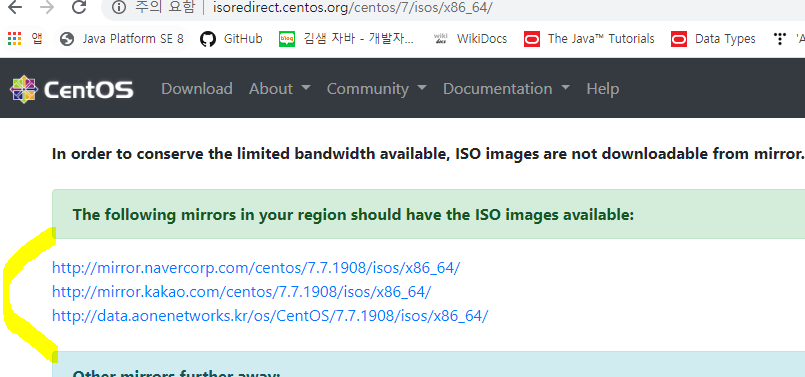

암거나 선택

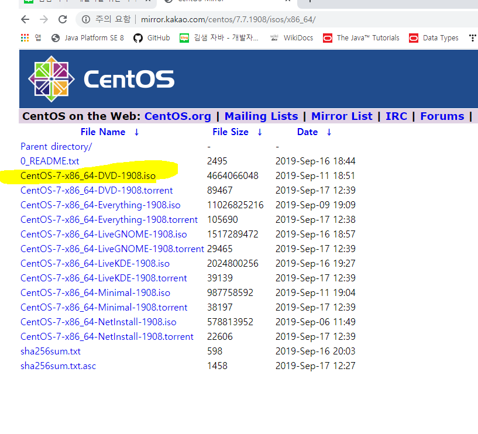

영문 경로로 저장

2. VM웨어

[**https://www.vmware.com/**](https://www.vmware.com/)

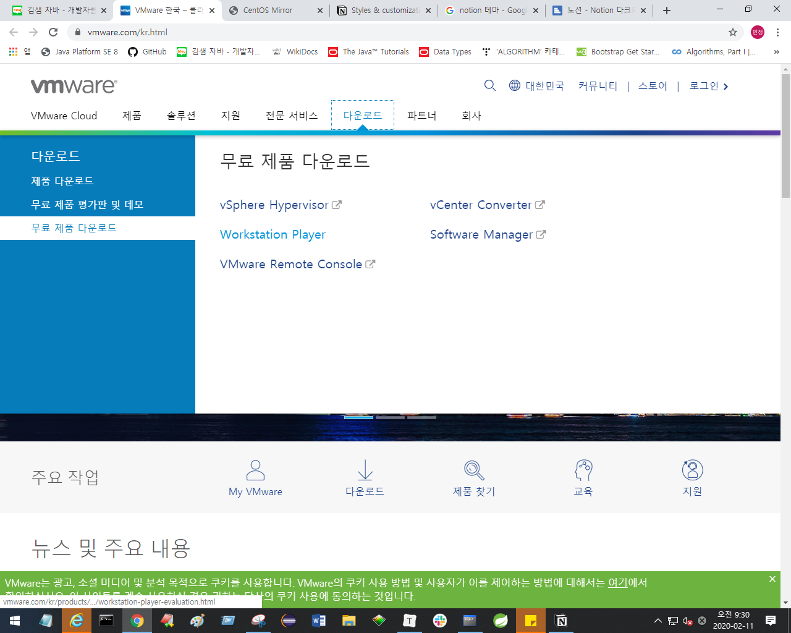

wrokstation player > 

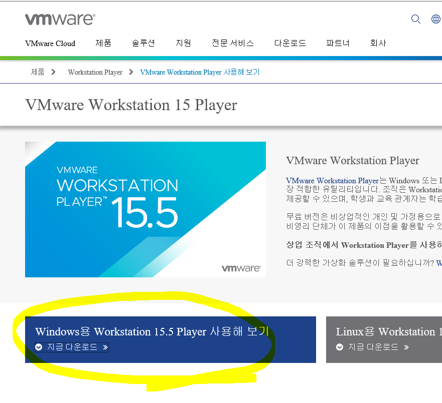

3. 선생님 블로그에 있는 pro, vmnetcfg 압축폴더 다운로드

2 개 파일 다운로드 하여 압축 풀기

---

### 설치 후 진행

1. pro > securable.exe > 보면 Hardware virtualization 이 YES로 되어있어서 가능하다. no로 되어있으면 따로 작업해줘야한다.

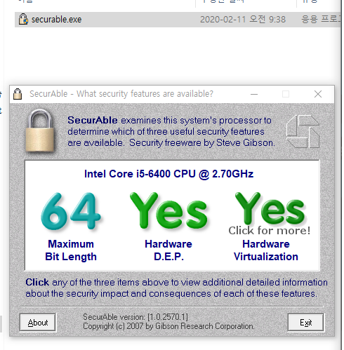

바깥쪽 PC : Host, 안쪽 PC : 게스트

VMware의 홈디렉토리는 다음과 같다.

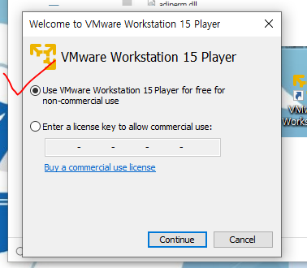

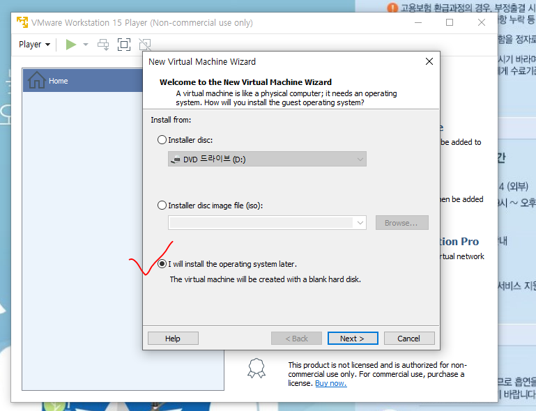

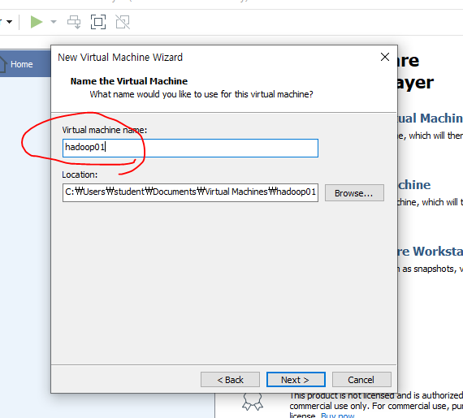

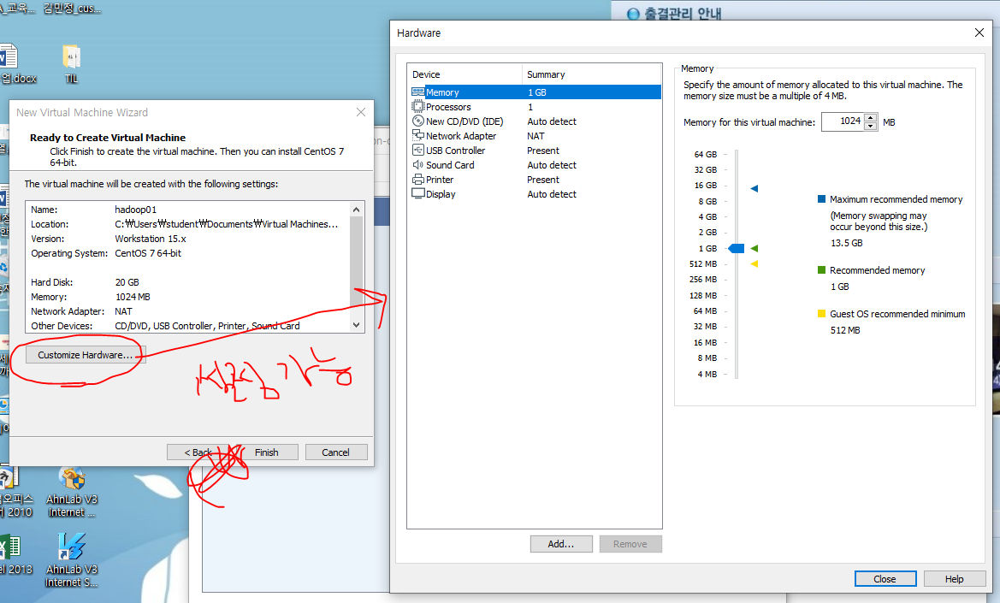

나중에도 설정가능해서 그냥 close > 하고 finish

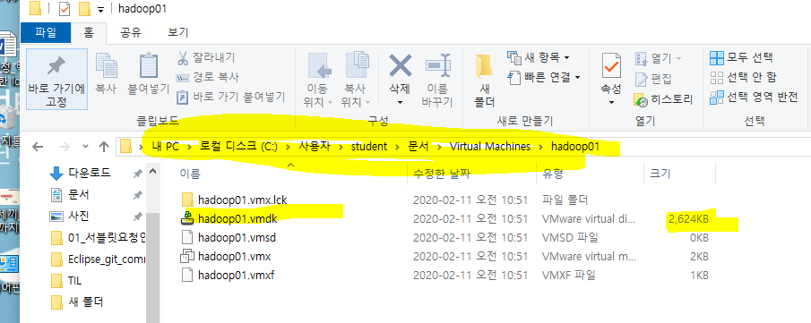

디렉토리에 vm이 생겼다. 일단 2기가로 되어있지만 나중에 설치하면서 사이즈가 늘어난다. 

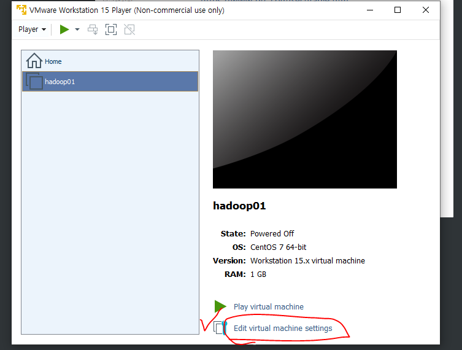

선택

hadoop1 을 Master로 할 예정. 메모리는 2gb로 설정해준다.

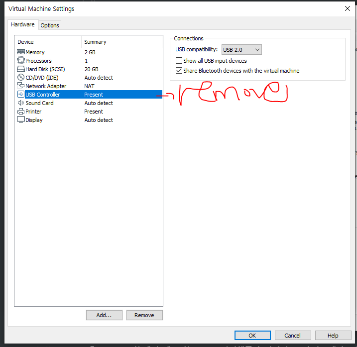

**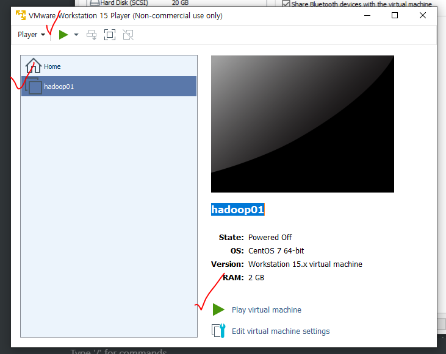**

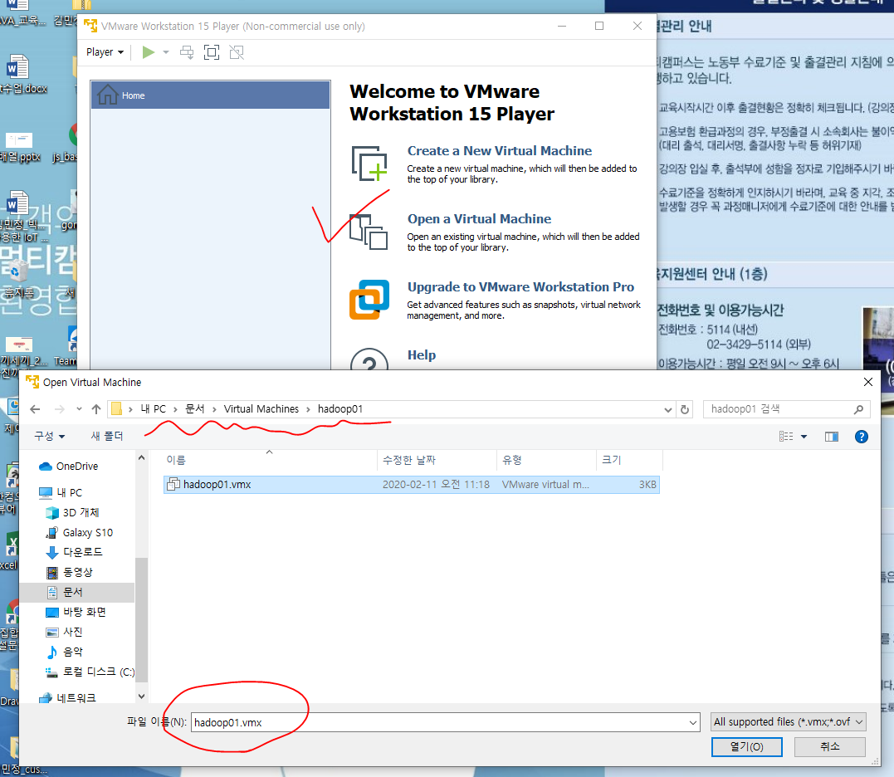

이 것을 넣어주면 작업 다시 가능하다.

이렇게 하면 모듈 없다고 오류창 뜨는데, 압축파일 복사해서 VMware 설치폴더에 넣는다

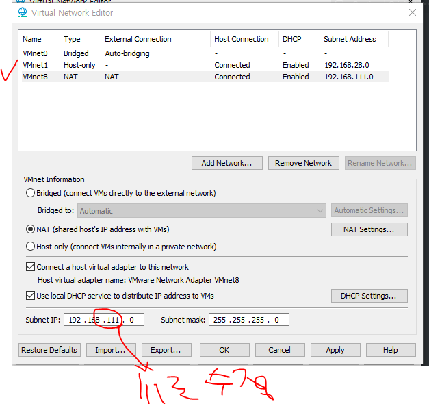

수정 후 cmd창에서 ipconfig 해보면 111로 수정된 것을 확인할수있다.

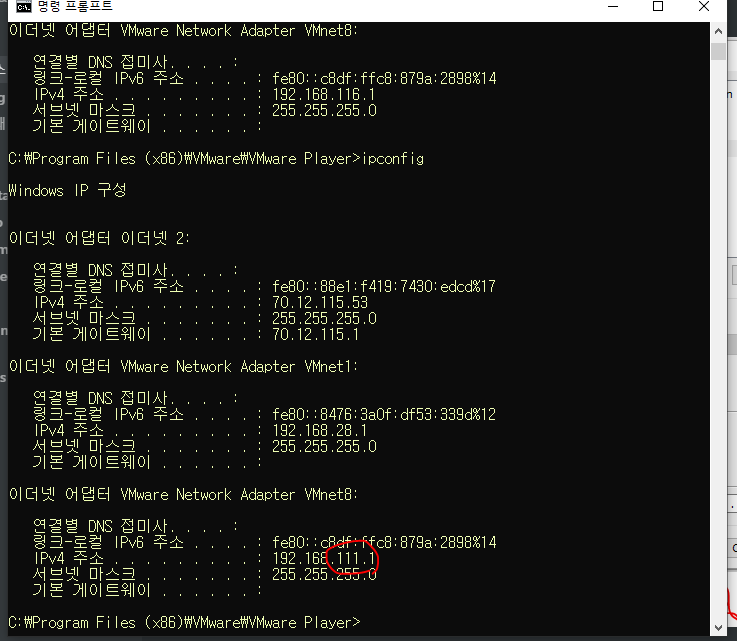

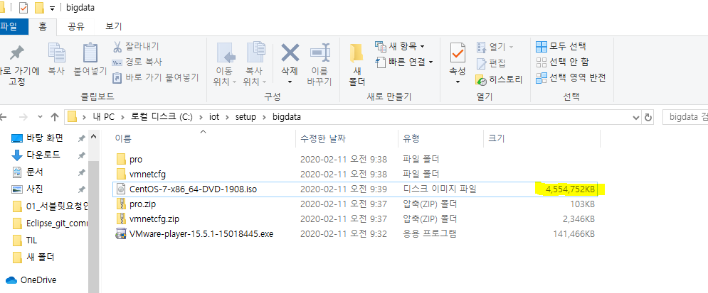

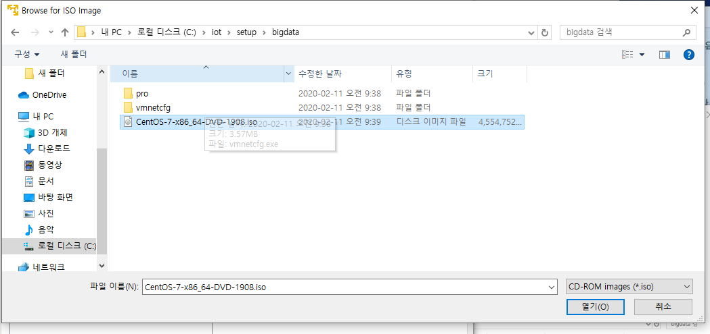

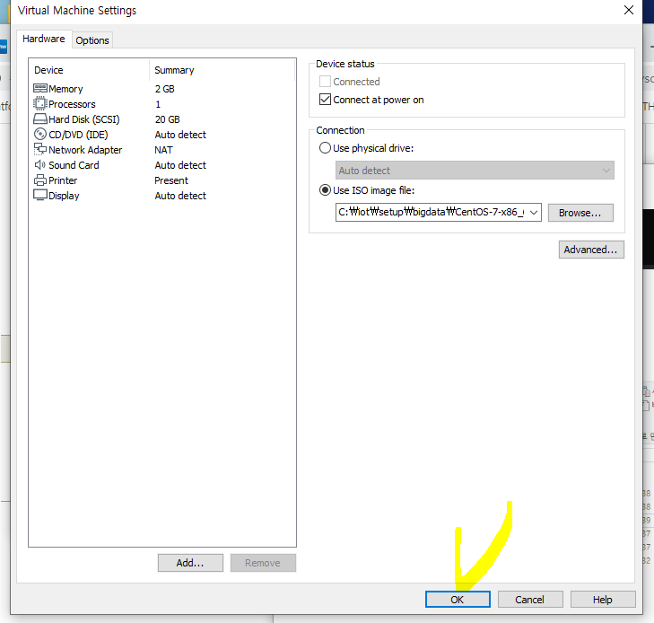

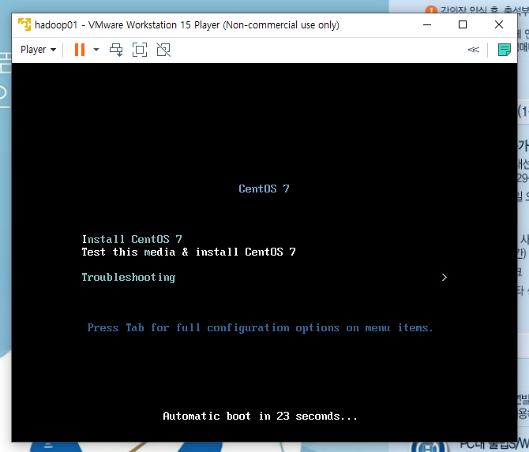